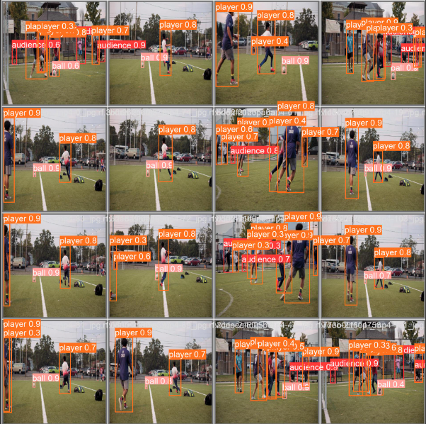

# Football-Player-Tracking

Hello, this projects detects and tracks the players, audience and the ball in a football game. It is trained on YOLOv8 ultralytics model. The data used to train the model is self annotated and the original video was taken from pexels.com. 

The results of the analysis were as follows: 

